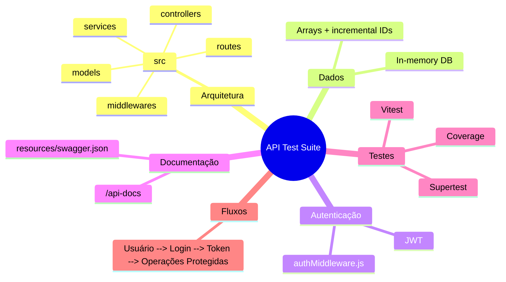

# Automação de Testes de API — PPP KiviaDantas
 
Projeto de portfólio focado em automação e validação de APIs (E‑Commerce). A solução implementa uma API REST em memória (para fins de teste), uma suíte de testes automatizados com Vitest + Supertest e documentação OpenAPI (Swagger). A API foi construída em Node.js usando Express e utiliza JWT para autenticação dos endpoints protegidos.
 
---
 
## Tecnologias e Dependências
 
- Node.js (ES Modules)
- Express
- Vitest (test runner)
- Supertest (integração HTTP nos testes)
- jsonwebtoken (JWT)
- swagger-ui-express (Swagger UI)
- nodemon (desenvolvimento)
 
As dependências estão descritas em `package.json`.
 
---
 
## Arquitetura e Estrutura de Pastas
 
Arquitetura organizada em camadas para clareza e testabilidade:
 
- `src/index.js` — entrypoint; monta e exporta o app Express; registra o Swagger UI em `/api-docs`.
- `src/api/routes/` — declara rotas por recurso (users, products).
- `src/api/controllers/` — camada de orquestração de requisições (validação básica, mapping de respostas).
- `src/api/services/` — lógica de negócio e armazenamento em memória (arrays) — ponto único para substituição por DB real.
- `src/api/models/` — factories / shape dos objetos retornados.
- `src/api/middlewares/` — middlewares, incluindo `authMiddleware.js` (JWT verification).
- `resources/swagger.json` — especificação OpenAPI (arquivo estático usado pelo Swagger UI).
- `tests/` — testes automatizados (Vitest + Supertest).
 
Essa separação permite testes em nível de integração (testando o servidor real) e facilita a futura migração para persistência real.
 
---
 
## Pré-requisitos
 
- Node.js v18 ou superior (recomendado)
- npm v9 ou superior
 
Verifique as versões:
 
```bash
node -v
npm -v
```
 
---
 
## Instalação e Execução Local
 
1. Clone o repositório e acesse a pasta:
 
```bash
git clone https://github.com/kiviachristina/ppp-KiviaDantas.git
cd ppp-KiviaDantas
```
 
2. Instale dependências:
 
```bash
npm install
```
 
3. Variáveis de ambiente (opcional — recomendado):
 
Defina `JWT_SECRET` e `PORT` (padrão 3000) via `.env` ou no ambiente:
 
```env
PORT=3000
JWT_SECRET=uma_chave_forte_aqui
```
 
4. Executar o servidor:
 
- Modo produção/local (sem reload):
 
```bash
node src/index.js
```
 
- Modo desenvolvimento (recarregamento automático com nodemon):
 
```bash
npm run dev
```
 
5. Acesse a documentação interativa (Swagger UI):
 
```
http://localhost:3000/api-docs
```
 
---
 
## Testes Automatizados
 
A suíte de testes usa Vitest e Supertest para validar os fluxos de negócio contra o app Express exportado (`src/index.js`).
 
- Executar toda a suíte:
 
```bash
npx vitest run
# ou
npm test
```
 
- Gerar relatório de cobertura (provider V8):
 
```bash
npm run test:coverage
```
 
O relatório será gerado em `coverage/`.
 
Observações de teste:
- Os testes criam dados dinamicamente (e-mails, nomes) para evitar colisões.
- O `NODE_ENV` é definido como `test` durante os testes para evitar que o servidor inicie o listener de rede.
 
---
 
## Autenticação e Segurança
 
- O projeto usa JWT para autenticação.
- Fluxo:
  1. `POST /api/users` — cria usuário (retorna objeto de usuário).
  2. `POST /api/users/login` — valida credenciais e retorna `{ authorization: "<JWT>" }`.
  3. Envie `Authorization: Bearer <JWT>` nos endpoints protegidos (`POST/PUT/DELETE /api/products`).
 
- Implementação:
  - `src/api/services/userService.js` emite o token com `jsonwebtoken` (expiração 1h, assinatura via `JWT_SECRET`).
  - `src/api/middlewares/authMiddleware.js` valida o token e injeta `req.user` com o payload.
 
Recomendações de segurança:
- Nunca commit `JWT_SECRET` em repositórios públicos; use ambiente seguro ou secret manager.
- Em produção, substitua armazenamento em memória por banco persistente e aplique validações adicionais, rate limiting e CORS apropriado.
 
---
 
## Endpoints principais (resumo)
 
- `POST /api/users` — criar usuário
- `POST /api/users/login` — login (retorna JWT)
- `POST /api/products` — criar produto (protegido)
- `GET /api/products` — listar produtos
- `GET /api/products/:id` — obter produto por id
- `PUT /api/products/:id` — atualizar produto (protegido)
- `DELETE /api/products/:id` — deletar produto (protegido)
 
Validações implementadas (exemplos):
- `preco` deve ser número maior que 0 (retorna 422 se inválido)
- `quantidade` deve ser número >= 0
- Campos obrigatórios ausentes retornam 400
 
Para detalhes completos das respostas e modelos JSON, consulte `resources/swagger.json` ou a UI em `/api-docs`.
 
---
 
## Wiki — Guia de Testes (foco QA)
 
Breve guia para profissionais de QA sobre como trabalhar e expandir a suíte de testes.
 
### Objetivos dos testes
- Verificar regras de negócio e casos de borda.
- Garantir integridade em cenários de autenticação e CRUD de produtos.
 
### Estratégia e boas práticas
- Escrever testes idempotentes e independentes.
- Preferir dados gerados dinamicamente (timestamps, random) em vez de valores estáticos.
- Testar comportamento observável (status codes, schema JSON, mensagens), não detalhes internos.
 
### Como adicionar casos de teste
1. Criar `tests/novo-caso.spec.js`.
2. Usar `supertest` com `app` importado de `src/index.js`.
3. Preparar dados, executar fluxo (ex.: criar usuário, login, usar token) e validar respostas.
 
Exemplo mínimo:
 
```js
import request from 'supertest';
import app from '../src/index.js';
import { describe, it, expect } from 'vitest';
 
describe('Smoke', () => {
  it('GET /api/products => 200', async () => {
    const res = await request(app).get('/api/products');
    expect(res.status).toBe(200);
  });
});
```
 
### Cobertura e CI
- Execute `npm run test:coverage` e adicione checagens no CI (ex.: GitHub Actions) para garantir coverage mínimo.
 
 
**Mapa Mental**
 

 
**Arquitetura Detalhada**
 
- **Camada de Rotas (`src/api/routes/`)**: define endpoints por recurso e conecta os requests aos controllers. É a camada de entrada HTTP e deve permanecer mínima (apenas roteamento e validação de rota).
 
- **Controllers (`src/api/controllers/`)**: atuam como orquestradores — recebem o request, validam parâmetros básicos, chamam os services e formatam a resposta HTTP (status codes, corpo JSON). Mantê-los sem lógica de negócio complexa facilita testes.
 
- **Services (`src/api/services/`)**: contém a lógica de negócio e regras de validação mais específicas. No projeto atual, também hospedam o armazenamento em memória (arrays com ids incrementais). Ao migrar para DB, essa camada é o principal ponto de substituição.
 
- **Models (`src/api/models/`)**: fábricas e formatos de objetos (usuário, produto). Padronizam shape dos objetos usados por services e controllers.
 
- **Middlewares (`src/api/middlewares/`)**: funções transversais como `authMiddleware.js` (validação de JWT e injeção de `req.user`), tratamento de erros e logs. Middlewares garantem separação de responsabilidades e reuso.
 
- **Documentação (`resources/swagger.json` + `swagger-ui-express`)**: arquivo OpenAPI que descreve modelos e respostas de erro; servido em `/api-docs` para consumo humano e como contrato leve para integrações.
 
- **Testes (`tests/`)**: suíte de integração com `Vitest` + `Supertest` que consome o app exportado em `src/index.js`. `NODE_ENV=test` evita side-effects (listener de rede) durante os testes.
 
- **Fluxo de Requisição (resumido)**:
  1. Cliente envia requisição HTTP para um endpoint em `routes`.
  2. Rota encaminha para o `controller` correspondente.
  3. `Controller` faz validações básicas e chama o `service`.
  4. `Service` aplica regras de negócio e persiste/consulta na store em memória.
  5. `Controller` monta a resposta (status + JSON) e a middleware de erro trata falhas.
 
- **Considerações para Produção**:
  - Substituir armazenamento em memória por um banco persistente (ex.: PostgreSQL, MongoDB).
  - Externalizar segredos (como `JWT_SECRET`) para variáveis de ambiente/secret manager.
  - Adicionar validação de payload robusta (ex.: `ajv`/Joi), rate limiting, CORS, e logging estruturado.
  - Incluir pipeline de CI para execução de testes e checagem de cobertura.
 
---
 
Se quiser, atualizo o `README.md` com diagramas de sequência ou uma coleção Postman exportada — qual formato prefere?  
 
 
Resultado esperado: cadastro com sucesso
 
<<<<<<< HEAD
### 2. Preço zerado
- payload com `preco: 0`
 
Resultado esperado: erro de validação
 
### 3. Preço negativo
- payload com `preco: -1`
 
Resultado esperado: erro de validação
 
### 4. Payload sem campos obrigatórios
- ausência de nome e/ou preço
 
Resultado esperado: erro de validação com mensagem clara
 
### 5. Caso de borda com nome longo
- entrada com string longa, mas válida na prática para o backend atual
 
Resultado observado: cadastro aceito sem regra de limite específica no backend
 
## Observações importantes
 
Durante a validação real com a API ServeRest, foi possível confirmar alguns comportamentos relevantes:
 
- o campo `administrador` deve ser enviado em formato string, conforme a API exige
- o endpoint `/produtos` exige campos obrigatórios para um cadastro válido
- a API rejeita `preco` zerado ou negativo com mensagens específicas
- a API atual não bloqueia nomes extremamente longos, e isso foi documentado como comportamento observado
 
Essas observações são importantes para a rotina de QA, porque refletem a realidade do sistema e ajudam a alinhar as expectativas de testes com o comportamento do backend.
 
## Resultado da execução
 
A suíte foi validada com sucesso via comando:
 
```bash
npm test
```
 
Saída esperada:
 
```text
Test Files  1 passed (1)
Tests       5 passed (5)
```
 
## Objetivo profissional
 
Este projeto foi desenvolvido como material de portfólio para demonstrar capacidade de:
 
- automação de testes de API
- análise de regras de negócio
- exploração de casos de borda
- documentação de testes e rastreabilidade
- apresentação de evidências de qualidade em projetos reais
 
## Autor
 
Kivia Dantas
 
## Licença
 
Este projeto está sob a licença ISC.
=======
## 👤 Autora
 
Kívia Dantas
 
