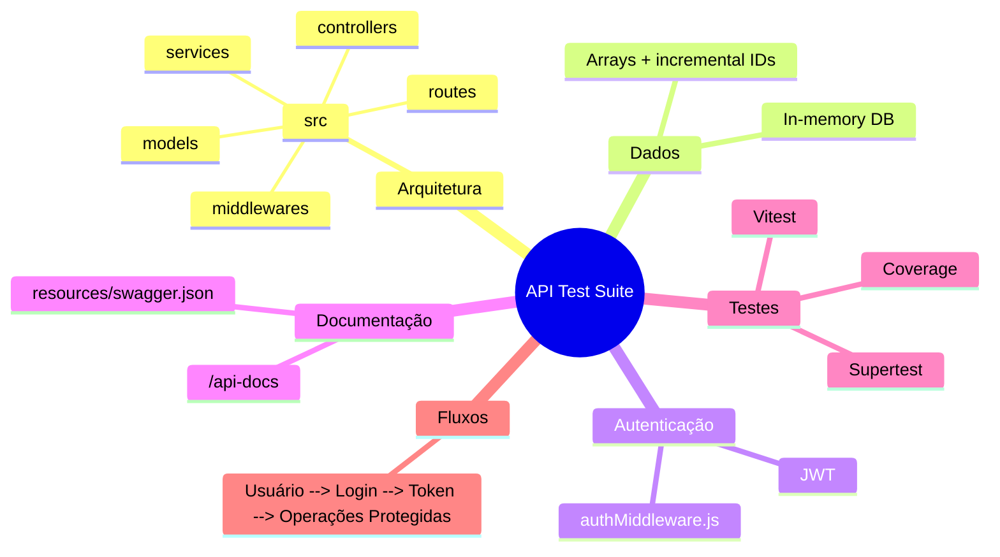

# Automação de Testes de API

Projeto de portfólio focado em automação e validação de APIs (E-Commerce). A solução implementa uma API REST em memória (para fins de teste), uma suíte de testes automatizados com Vitest + Supertest e documentação OpenAPI (Swagger). A API foi construída em Node.js usando Express e utiliza JWT para autenticação dos endpoints protegidos.

---

## Sumário

- [Tecnologias e Dependências](#tecnologias-e-dependências)
- [Arquitetura e Estrutura de Pastas](#arquitetura-e-estrutura-de-pastas)
- [Fluxo de Requisição](#fluxo-de-requisição)
- [Pré-requisitos](#pré-requisitos)
- [Instalação e Execução Local](#instalação-e-execução-local)
- [Testes Automatizados](#testes-automatizados)
- [Autenticação e Segurança](#autenticação-e-segurança)
- [Endpoints Principais](#endpoints-principais-resumo)
- [Guia para Contribuir com Testes](#guia-para-contribuir-com-testes)
- [Considerações para Produção](#considerações-para-produção)
- [Objetivo Profissional](#objetivo-profissional)
- [Licença](#licença)
- [Autora](#autora)

---

## Tecnologias e Dependências

- Node.js (ES Modules)
- Express
- Vitest (test runner)
- Supertest (integração HTTP nos testes)
- jsonwebtoken (JWT)
- swagger-ui-express (Swagger UI)
- nodemon (desenvolvimento)

As dependências estão descritas em `package.json`.

---

## Arquitetura e Estrutura de Pastas

Arquitetura organizada em camadas para clareza e testabilidade:

- **Rotas (`src/api/routes/`)** — definem os endpoints por recurso (users, products) e conectam os requests aos controllers. Camada de entrada HTTP, mantida mínima (apenas roteamento e validação de rota).

- **Controllers (`src/api/controllers/`)** — orquestram as requisições: recebem o request, validam parâmetros básicos, chamam os services e formatam a resposta HTTP (status codes, corpo JSON). Sem lógica de negócio complexa, o que facilita os testes.

- **Services (`src/api/services/`)** — contêm a lógica de negócio e as regras de validação mais específicas. No projeto atual, também hospedam o armazenamento em memória (arrays com IDs incrementais) — principal ponto de substituição ao migrar para um banco real.

- **Models (`src/api/models/`)** — fábricas e formatos dos objetos (usuário, produto), padronizando o shape usado por services e controllers.

- **Middlewares (`src/api/middlewares/`)** — funções transversais, como `authMiddleware.js` (validação de JWT e injeção de `req.user`), tratamento de erros e logs.

- **Documentação (`resources/swagger.json`)** — especificação OpenAPI servida via `swagger-ui-express` em `/api-docs`, usada como referência humana e contrato leve para integrações.

- **Testes (`tests/`)** — suíte de integração com Vitest + Supertest, consumindo o app exportado em `src/index.js`. `NODE_ENV=test` evita side-effects (como o listener de rede) durante a execução.

- **`src/index.js`** — entrypoint; monta e exporta o app Express; registra o Swagger UI em `/api-docs`.

Essa separação permite testes em nível de integração (testando o servidor real) e facilita a futura migração para persistência real.



### Fluxo de Requisição

1. Cliente envia requisição HTTP para um endpoint em `routes`.
2. A rota encaminha para o `controller` correspondente.
3. O `controller` faz validações básicas e chama o `service`.
4. O `service` aplica regras de negócio e persiste/consulta na store em memória.
5. O `controller` monta a resposta (status + JSON); a middleware de erro trata falhas.

---

## Pré-requisitos

- Node.js v18 ou superior (recomendado)
- npm v9 ou superior

Verifique as versões:

```bash
node -v
npm -v
```

---

## Instalação e Execução Local

1. Clone o repositório e acesse a pasta:

```bash
git clone https://github.com/kiviachristina/ppp-KiviaDantas.git
cd ppp-KiviaDantas
```

2. Instale as dependências:

```bash
npm install
```

3. Variáveis de ambiente (opcional — recomendado):

Defina `JWT_SECRET` e `PORT` (padrão 3000) via `.env` ou no ambiente:

```env
PORT=3000
JWT_SECRET=uma_chave_forte_aqui
```

4. Execute o servidor:

- Modo produção/local (sem reload):

```bash
node src/index.js
```

- Modo desenvolvimento (recarregamento automático com nodemon):

```bash
npm run dev
```

5. Acesse a documentação interativa (Swagger UI):

```
http://localhost:3000/api-docs
```

---

## Testes Automatizados

A suíte de testes usa Vitest e Supertest para validar os fluxos de negócio contra o app Express exportado (`src/index.js`).

- Executar toda a suíte:

```bash
npx vitest run
# ou
npm test
```

- Gerar relatório de cobertura (provider V8):

```bash
npm run test:coverage
```

O relatório será gerado em `coverage/`.

**Observações de teste:**

- Os testes criam dados dinamicamente (e-mails, nomes) para evitar colisões.
- O `NODE_ENV` é definido como `test` durante os testes para evitar que o servidor inicie o listener de rede.

---

## Autenticação e Segurança

O projeto usa JWT para autenticação. Fluxo:

1. `POST /api/users` — cria usuário (retorna objeto de usuário).
2. `POST /api/users/login` — valida credenciais e retorna `{ authorization: "<JWT>" }`.
3. Envie `Authorization: Bearer <JWT>` nos endpoints protegidos (`POST/PUT/DELETE /api/products`).

**Implementação:**

- `src/api/services/userService.js` emite o token com `jsonwebtoken` (expiração 1h, assinatura via `JWT_SECRET`).
- `src/api/middlewares/authMiddleware.js` valida o token e injeta `req.user` com o payload.

**Recomendações de segurança:**

- Nunca faça commit do `JWT_SECRET` em repositórios públicos; use variáveis de ambiente ou um secret manager.
- Em produção, substitua o armazenamento em memória por um banco persistente e aplique validações adicionais, rate limiting e CORS apropriado.

---

## Endpoints principais (resumo)

| Método | Rota | Descrição | Protegido |
|---|---|---|---|
| POST | `/api/users` | Criar usuário | Não |
| POST | `/api/users/login` | Login (retorna JWT) | Não |
| POST | `/api/products` | Criar produto | Sim |
| GET | `/api/products` | Listar produtos | Não |
| GET | `/api/products/:id` | Obter produto por ID | Não |
| PUT | `/api/products/:id` | Atualizar produto | Sim |
| DELETE | `/api/products/:id` | Deletar produto | Sim |

**Validações implementadas (exemplos):**

- `preco` deve ser número maior que 0 (retorna 422 se inválido).
- `quantidade` deve ser número >= 0.
- Campos obrigatórios ausentes retornam 400.

Para detalhes completos das respostas e modelos JSON, consulte `resources/swagger.json` ou a UI em `/api-docs`.

---

## Guia para Contribuir com Testes

Breve guia para profissionais de QA sobre como trabalhar e expandir a suíte de testes.

**Objetivos dos testes:**

- Verificar regras de negócio e casos de borda.
- Garantir integridade em cenários de autenticação e CRUD de produtos.

**Estratégia e boas práticas:**

- Escrever testes idempotentes e independentes.
- Preferir dados gerados dinamicamente (timestamps, random) em vez de valores estáticos.
- Testar comportamento observável (status codes, schema JSON, mensagens), não detalhes internos.

**Como adicionar casos de teste:**

1. Criar `tests/novo-caso.spec.js`.
2. Usar `supertest` com `app` importado de `src/index.js`.
3. Preparar dados, executar o fluxo (ex.: criar usuário, login, usar token) e validar as respostas.

Exemplo mínimo:

```js
import request from 'supertest';
import app from '../src/index.js';
import { describe, it, expect } from 'vitest';

describe('Smoke', () => {
  it('GET /api/products => 200', async () => {
    const res = await request(app).get('/api/products');
    expect(res.status).toBe(200);
  });
});
```

**Cobertura e CI:**

Execute `npm run test:coverage` para gerar o relatório localmente. *(Próximo passo: adicionar um pipeline de CI, ex. GitHub Actions, para rodar a suíte e checar cobertura mínima a cada push.)*

---

## Considerações para Produção

- Substituir o armazenamento em memória por um banco persistente (ex.: PostgreSQL, MongoDB).
- Externalizar segredos (como `JWT_SECRET`) para variáveis de ambiente/secret manager.
- Adicionar validação de payload mais robusta (ex.: `ajv`/Joi), rate limiting, CORS e logging estruturado.
- Incluir pipeline de CI para execução de testes e checagem de cobertura.

---

## Objetivo Profissional

Este projeto foi desenvolvido como material de portfólio para demonstrar capacidade de:

- Automação de testes de API.
- Análise de regras de negócio.
- Exploração de casos de borda.
- Documentação de testes e rastreabilidade.
- Apresentação de evidências de qualidade em projetos reais.

---

## Licença

Este projeto está sob a licença ISC.

---

## Autora

Kívia Dantas
